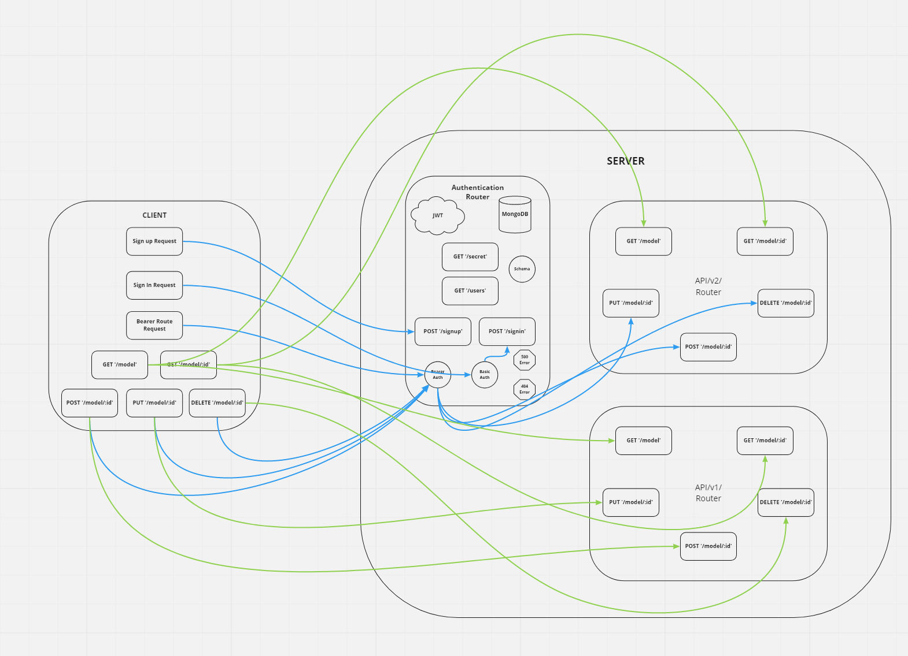

# auth-api

In this lab,  i did  that  implement Role Based Access Control (RBAC) using an Access Control List (ACL), allowing to not only restrict access to routes for valid users, but also based on the individual permissions we give each user.

[herkou](https://dashboard.heroku.com/apps/api-autheman/deploy/github)

[PR](https://github.com/emanmkhareez/auth-api/pulls?q=is%3Apr+is%3Aclosed)

